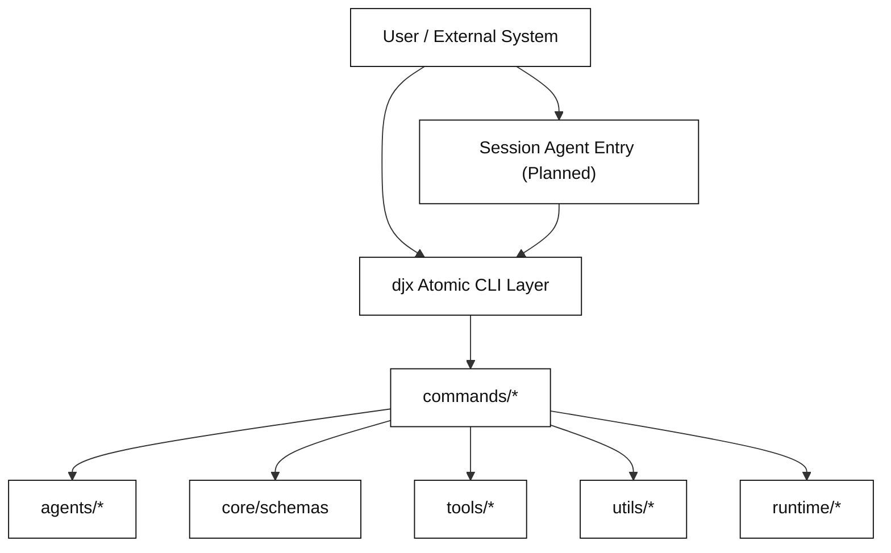

# Project Overview (DJX v0.1)

This document provides a concise architecture overview of the current
`data-juicer-agents` project after the DJX-oriented refactor.

## 1. What This Project Is

`data-juicer-agents` currently positions `djx` as a **packaged atomic
capability layer** over Data-Juicer.

Important positioning update:

- The CLI is not the final conversation surface.
- The CLI provides composable tools (planning, execution, trace, evaluation)
  for higher-level orchestration agents.
- A unified session-level agent entry is planned for future iterations.
- `dev` is planned as another **atomic CLI capability** (same layer as
  `plan/apply/trace/evaluate`), used when current Data-Juicer operators cannot
  satisfy the requirement and new operators need to be developed.

Current production command surface:

- `djx plan`
- `djx apply`
- `djx trace`
- `djx templates`
- `djx evaluate`

The design focus is:

- workflow-first planning
- explicit schema validation
- deterministic execution
- traceable runs and evaluation metrics

## 2. Project Architecture Diagram



## 3. High-Level Runtime Layers

```
CLI (djx)
  -> atomic capability packaging
  -> commands/*
      -> agents/*        (planning/validation/execution behavior)
      -> core/schemas    (stable data contracts)
      -> tools/*         (routing, probing, registry integrations)
      -> utils/*         (pure reusable helpers)
      -> runtime/*       (trace persistence and aggregation)
```

Future target:

- add `dev` as a first-class atomic DJX capability for unmet requirements and
  operator development
- add a unified session agent entry for multi-turn orchestration
- keep `djx` as low-level tool interface callable by those upper layers

## 4. Main Code Layout

### 4.1 `data_juicer_agents/cli.py`

CLI entrypoint and argument parsing.  
Routes each subcommand to a handler in `commands/`.

### 4.2 `data_juicer_agents/commands/`

Command handlers (thin orchestration layer):

- `plan_cmd.py`: plan generation and revision mode (`--base-plan`, `--from-run-id`)
- `apply_cmd.py`: execute plan and persist run trace
- `trace_cmd.py`: replay single run / aggregate stats (global or by `plan_id`)
- `templates_cmd.py`: inspect built-in workflow templates
- `evaluate_cmd.py`: offline batch evaluation with retries and reporting

### 4.3 `data_juicer_agents/agents/`

Behavioral/role modules:

- `planner_agent.py`: template-first planning, full-LLM planning, revision planning
- `react_planner_agent.py`: minimal ReAct planner for `--llm-full-plan`
- `validator_agent.py`: schema + path + modality + operator availability checks
- `executor_agent.py`: deterministic recipe rendering + command execution + error classification

### 4.4 `data_juicer_agents/core/`

Stable domain core:

- `schemas.py`: `PlanModel`, `RunTraceModel`, and `validate_plan`
- `_version.py`: package version

### 4.5 `data_juicer_agents/tools/`

Operational integrations:

- `router_helpers.py`: intent-to-workflow routing helpers
- `dataset_probe.py`: sample-based modality/key inference
- `operator_registry.py`: installed operator discovery + name normalization
- `op_manager/`: operator metadata retrieval backend

### 4.6 `data_juicer_agents/utils/`

Shared pure utilities:

- `llm_utils.py`: OpenAI-compatible JSON call wrapper with model fallback
- `plan_diff.py`: structured diff and summary for iterative plan revisions

### 4.7 `data_juicer_agents/runtime/`

Runtime persistence:

- `trace_store.py`: append-only JSONL trace storage and stats

### 4.8 `data_juicer_agents/workflows/`

Built-in workflow templates:

- `rag_cleaning.yaml`
- `multimodal_dedup.yaml`

## 5. Data & Evaluation Assets

- `data/`: demo datasets used by examples/tests
- `eval_cases/`: offline evaluation case sets
- `.djx/`: runtime artifacts (recipes, run traces, eval outputs)

## 6. Documentation & Tests

- `docs/`: user and developer docs (QuickStart, schema, CLI reference, audit notes, notebook demo)
- `tests/`: end-to-end and unit tests for planning, execution, trace, and evaluation

## 7. Notes on Scope

The repository still contains independent modules such as:

- `interactive_recipe/`
- `qa-copilot/`

They are not part of the current DJX main execution path.
